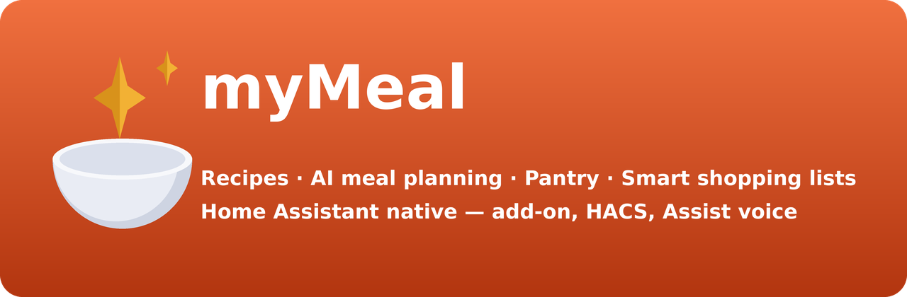

<p align="center">
  
</p>

# myMeal

[](https://github.com/Amantux/mymeal/actions/workflows/ha-validate.yml)
[](https://github.com/Amantux/mymeal/actions/workflows/ci.yml)
[](https://hacs.xyz/docs/faq/custom_repositories)
[](https://www.home-assistant.io/addons/)
[](https://www.home-assistant.io/)
[](LICENSE)

**Self-hosted recipes, AI meal planning, pantry & smart shopping lists — with a
Home Assistant cooking assistant built in.**

myMeal is a privacy-first, self-hosted kitchen companion. Keep your recipe
collection, let an AI help you plan the week and cook, track what's in your
pantry, and generate consolidated shopping lists — all runnable standalone or as
a Home Assistant add-on with voice control through Assist.

> **Status:** all five milestones shipped — core recipe management, AI recipe
> import + pluggable providers, meal planning, pantry, smart shopping lists, the
> conversational cooking agent, the MCP server, and the Home Assistant
> integration. See the [CHANGELOG](CHANGELOG.md).

## Highlights (target feature set)

- 📖 **Recipe manager** — structured ingredients & steps, images, categories,
  tags, favorites, fast search.
- 🤖 **Pluggable AI** — Claude, Ollama, or OpenAI behind one interface. Import a
  recipe from a URL or pasted text, ask "what can I cook with what I have", and
  generate weekly meal plans.
- 🗓️ **Meal planning** — a weekly planner that also feeds your calendar.
- 🧺 **Pantry-aware** — track stock and get suggestions that minimize shopping.
- 🛒 **Smart shopping lists** — auto-built from your plan, deduped and grouped by
  aisle.
- 💬 **Cooking agent** — chat with an assistant that helps you build and cook
  recipes.
- 🔌 **Home Assistant native** — an MCP server exposes tools to Assist so you can
  ask "what's for dinner?" and manage your list by voice.

## Architecture

```
backend/          Flask API (app factory, /api/v1), SQLAlchemy models, MCP server
frontend/         Vue 3 + Vite SPA (served by the backend)
custom_components/ Home Assistant (HACS) integration — config flow, sensors, calendar, services, card
mymeal/           Home Assistant add-on config
Dockerfile        Multi-stage build (frontend → python runtime)
```

The backend serves both the JSON API under `/api/v1` and the built SPA. Auth is
JWT by default, or disabled (`MYMEAL_DISABLE_AUTH=true`) when running behind
Home Assistant ingress, which already authenticates the user.

## Running

### Docker (standalone)

```bash
docker compose up --build
# → http://localhost:7850
```

Set a strong `MYMEAL_SECRET_KEY` in `docker-compose.yml` before exposing it.

### Local development

```bash
# Backend
cd backend
pip install -r requirements.txt
python run.py            # http://localhost:7850

# Frontend (separate terminal, proxies /api to :7850)
cd frontend
npm install
npm run dev              # http://localhost:5173
```

## Home Assistant

myMeal ships **two independent install paths**. They are complementary, not
alternatives — the add-on runs the app, the integration surfaces it as entities.

### Path 1 — the add-on (runs myMeal inside HA)

**Settings → Add-ons → Add-on Store → ⋮ → Repositories → Add**

```
https://github.com/Amantux/mymeal
```

Then install **myMeal** and click **Open Web UI**.

**You will not be asked to sign in.** Ingress is enabled (`ingress: true`,
`ingress_port: 7850`) and the add-on ships `disable_auth: true` by default:
Home Assistant has already authenticated you at the ingress layer, so a second
login would be pure friction. The frontend asks the backend directly
(`GET /api/v1/misc/auth-mode`) whether sign-in is required rather than inferring
it, so a transient error can never bounce you to a login screen inside HA. The
MCP server is exposed on port `7851` for the Home Assistant MCP Client.

> Running myMeal **outside** HA? Auth stays fully on — `disable_auth` only flips
> in the add-on. Never set `MYMEAL_DISABLE_AUTH=true` on anything reachable from
> an untrusted network: it binds every request to a single local user.

### Path 2 — the HACS integration (entities, calendar, voice)

**HACS → ⋮ → Custom repositories** → add `https://github.com/Amantux/mymeal`
with category **Integration** → install **myMeal** → restart HA → **Settings →
Devices & Services → Add Integration → myMeal**.

If you installed the add-on, it advertises itself via Supervisor discovery and
the integration should offer to configure itself with no URL or token typing.

You get:

| Kind | What |
|---|---|
| Sensors | today's meals, shopping-list count, expiring pantry items |
| Calendar | your meal plan as a native HA calendar entity |
| Services | `add_to_shopping_list`, `plan_week`, `whats_for_dinner` |
| Voice | Assist sentences — *"what's for dinner?"*, *"add milk to my shopping list"* |
| Lovelace | `mymeal-card.js` dashboard card |

### Pending external steps

These require action outside this repo and are **not** done:

- **Brand icons** — the `mymeal` domain is not yet registered in
  [home-assistant/brands](https://github.com/home-assistant/brands), so HA shows
  a generic icon. That needs a PR against that upstream repo; the `brands` check
  is explicitly ignored in `ha-validate.yml` rather than silently passing.
- **Default HACS listing** — myMeal installs as a *custom repository*. Inclusion
  in the default HACS store is a separate application to HACS.

## Configuration

All configuration is via `MYMEAL_`-prefixed environment variables:

| Variable | Default | Purpose |
|---|---|---|
| `MYMEAL_SECRET_KEY` | `change-me…` | JWT signing key (set in production) |
| `MYMEAL_DISABLE_AUTH` | `false` | Single-tenant mode behind a trusted proxy / HA ingress |
| `MYMEAL_ALLOW_REGISTRATION` | `true` | Allow public sign-up |
| `MYMEAL_DATA_DIR` | `./data` | SQLite DB + uploaded images |
| `MYMEAL_PORT` | `7850` | HTTP port |
| `MYMEAL_AI_PROVIDER` | _(blank)_ | `claude` \| `ollama` \| `openai` (AI features) |

## Development

```bash
cd backend && ruff check . && pytest -q     # lint + tests
cd frontend && npm run build                # type/build check
```

## License

[AGPL-3.0](LICENSE). (myMeal is original, clean-room software; the license
choice mirrors the project owner's other self-hosted tools and can be changed.)
